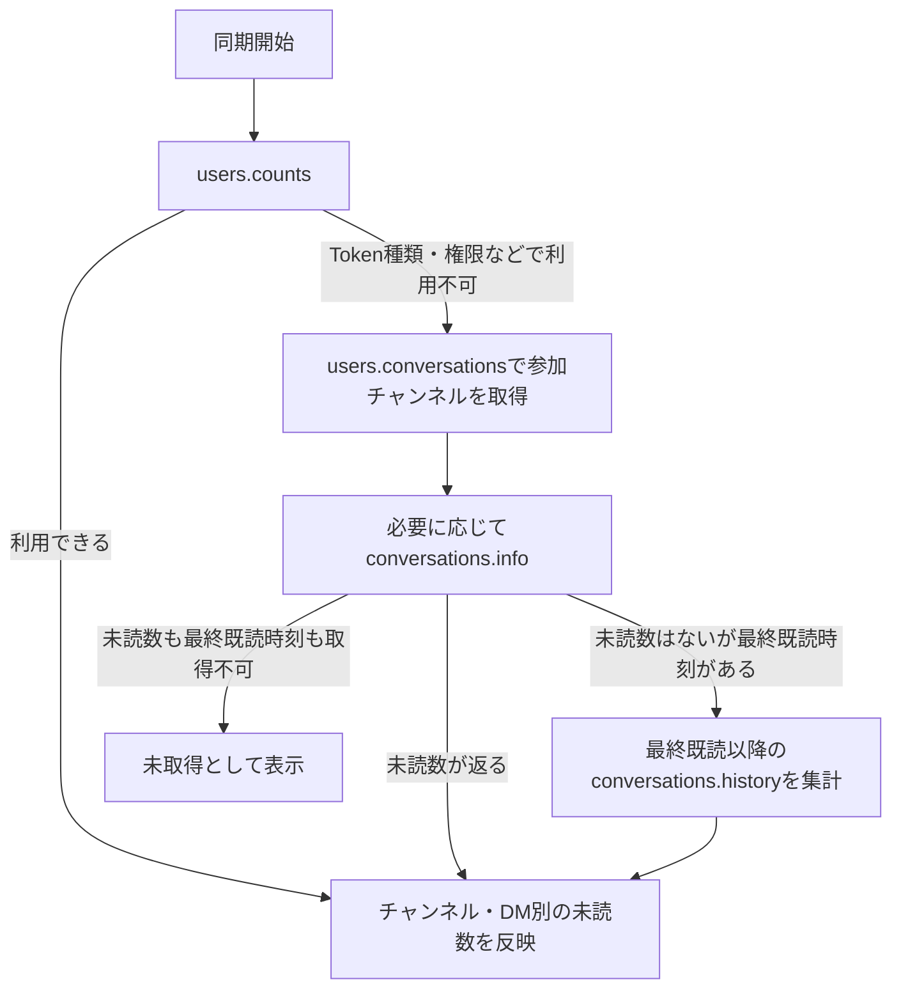

# 未読数の取得・同期ロジック

この文書は現在の実装の挙動をまとめたものです。未読取得は [slack_rtm.js](../src/slack_rtm.js)、HTTP通信と履歴記録は [slack_api.js](../src/slack_api.js)、起動・定期同期・バッジ表示は [background.js](../src/background.js)、設定画面は [options.js](../src/options.js) に実装されています。

## 1. 同期するタイミング

- バックグラウンドのサービスワーカーが起動したとき。
- WebSocketが接続・再接続できたとき。
- Chromeの定期アラームが発火したとき。通常は5分間隔、以下の安定条件を満たす間は30分間隔。
- 設定画面の「未読データを再取得」を押したとき。
- 削除イベント受信時。対象チャンネルのみHTTPで再取得する。
- WebSocketが切断されたとき。実行中の同期があれば共有する。
- Tokenが変更されたとき。古い接続・内部データを破棄し、設定と未読データを取得し直す。

HTTPでの未読取得とWebSocket接続は並行して開始するため、WebSocketが接続できなくてもHTTP同期は動作します。同期中に別の同期要求が来た場合は、実行中の処理を共有し、同じ同期を重複実行しません。長い同期の間は、バックグラウンド側で20秒ごとにChrome APIを呼び、サービスワーカーの休止を防ぎます。

設定画面の2秒ごとの更新は、バックグラウンドが保持する診断データを読み直すものです。2秒ごとに未読数全体をSlackから取得する処理ではありません。ただし、未読のあるチャンネルの名前が不明な場合は、表示用に追加の情報取得を行います。

### WebSocketが安定したときのHTTP間隔

次の条件がすべて揃った場合に、HTTPの定期同期を5分から30分間隔へ変更します。

1. 同じWebSocket接続が11分以上継続している。
2. その接続後に開始・完了したHTTP未読同期が2回以上成功している。
3. 直近60秒以内に、その接続から `pong` を受信している。

起動時の同期が接続前に始まっていた場合は成功回数に含めず、その完了後に接続後の同期を開始します。API単体の成功やチャンネル名の取得ではなく、未読数全体の同期を数えます。一部取得・未読数が概算・同期失敗の場合は成功回数を0に戻します。メンション数だけが取得できない場合は、未読数全体が取得できていれば成功として数えます。手動同期も条件を満たせば成功回数に含まれます。

接続継続時間だけで安定と判断しないため、HTTP同期が遅延・失敗した場合は11分を過ぎても5分間隔を維持します。条件の判定はHTTP同期完了、pong受信、20秒ごとの接続確認時に行います。同期間隔が変わった時点からChromeのアラームを設定し直します。ブラウザの休止などで実際の発火が遅れることがあります。

切断・再接続・Token変更では接続ごとの成功回数とpong時刻をリセットし、5分間隔へ戻して直ちにHTTP同期を要求します。20秒ごとの確認で、接続開始または最終pongから60秒以上応答がなければソケットを閉じ、再接続します。

HTTPは完全には停止しません。判定材料がないメンション・削除やイベント取りこぼしによるズレは、最長で次の定期同期まで残る可能性があります。手動同期と表示用のチャンネル名取得は、30分間隔でも実行できます。設定画面には現在の間隔・判定理由・接続後の成功回数・最終pong時刻を表示します。

## 2. HTTPでの取得経路



### 通常経路: users.counts

まず `users.counts` を呼び、`channels`、`groups`、`mpims`、`ims` を読み取ります。IDのない項目とアーカイブ済みのチャンネルは内部の未読集計から除外します。

次のエラーの場合は、公開APIを使う代替経路へ切り替えます。

- `not_allowed_token_type`
- `missing_scope`
- `unknown_method`
- `method_deprecated`

切り替え後は、同じサービスワーカーの稼働中は代替経路を使用します。Token変更・サービスワーカー再起動で、再び `users.counts` から試します。その他の通信エラーや認証エラーで、代替経路へ無条件に切り替えることはありません。

### 代替経路: 参加チャンネル一覧と個別情報

`users.conversations` を、公開チャンネル・非公開チャンネル・グループDM・DMの4種類に分けて呼びます。アーカイブ済みは除外し、1回の要求では最大200件を指定します。`next_cursor` がある間は、空のページであっても続きのページを取得します。

種類ごとに `missing_scope`、`no_permission`、`invalid_types` が返る場合は、その種類を取得権限不足として記録し、他の種類の取得を続けます。4種類すべてが取得できなければ同期失敗です。一部の種類だけ取得できない場合は、最終結果を「一部未取得」とします。

一覧に未読数がないチャンネルは `conversations.info` で詳細を取得します。そこに未読数も未読有無もなく、有効な `last_read` がある場合は、次の方法で未読を算出します。

1. `latest` が最終既読時刻以前なら未読0件とする。
2. それ以外は `conversations.history` で、`last_read` より後のメッセージを取得する。
3. 取得範囲の上限を固定し、カーソルまたは時刻で最大5ページまでたどる。
4. 後述の対象メッセージだけを数える。

5ページを取得しても続きがある場合は打ち切り、取得済みの未読件数を下限値（「N件以上」）として反映します。同期は「一部未取得」とし、30分間隔への切り替え条件には含めません。この上限はチャンネルごとの1回の同期に適用し、次の同期でも最終既読時刻から集計し直します。

履歴取得の時刻上限には、チャンネル情報の最新メッセージ時刻を使用します。最新時刻がない場合は集計開始時点の時刻を使用します。上限のメッセージを含めるため、上限に1マイクロ秒を加え、`inclusive: false` としています。

チャンネル単位の情報取得で失敗した場合は、そのチャンネルに理由を記録します。ただし、レート制限、無効な認証、Token失効・取り消しのエラーでは同期全体を中断します。

## 3. 未読数・メンション数の読み取り

有限で0以上の数値、または数値に変換できる空でない文字列を採用します。項目が存在しない場合を0件として扱いません。

| 値 | 優先して読むフィールド |
| --- | --- |
| 未読数 | `unread_count_display` → `unread_count` → DMの場合のみ `dm_count` |
| メンション・DM数 | `mention_count_display` → `mention_count` → DMの場合のみ `dm_count` |

未読数がなく `has_unreads` だけがある場合、`false` は0件、`true` は1件以上として扱います。設定画面では後者を「1以上」と表示します。`ims` に含まれる項目はDMとして扱います。

どの項目からも値が取れなければ内部では `null`、画面では「未取得」です。公開APIの応答に未読数と最終既読時刻の両方がない場合は、過去の未読数を復元できません。履歴からの集計でも、メンション数を別途推測して埋めることはありません。

## 4. WebSocketによる更新

`rtm.connect` で接続先を取得してWebSocketを開きます。接続中は20秒ごとに `ping` を送信します。

| イベント | 内部データへの反映 |
| --- | --- |
| `channel_marked` / `group_marked` | イベント内の未読数・メンション数で対象チャンネルを上書きする。値がない場合は未取得になる。 |
| `im_marked` | DMの未読数とメンション・DM数をイベントの値で更新する。 |
| `message` | 未読対象なら未読数を1増やす。接続ユーザーへの直接メンションはメンション数を1増やす。DM・グループDMはメンション・DM数も1増やす。 |
| `message_deleted` | 記録済みのメッセージが未読なら未読数とメンション・DM数を減らす。既読済みなら減らさない。 |
| `message_changed` | 記録済みの未読メッセージの編集に合わせてメンション数を増減する。 |
| `pref_change` | 通知設定のミュート対象を更新し、合計を再計算する。 |
| `pong` | 件数を変更しない。最終受信時刻・最終pong時刻を更新し、HTTP同期間隔を判定する。 |

未読対象とするのは `type: message` のうち、編集・削除・返信情報の更新、参加・退出、チャンネル名・トピック・目的の変更を除いたものです。通常のスレッド返信も除外し、チャンネルに共有された `thread_broadcast` は数えます。同じ判定をHTTP履歴の集計にも使用します。

### メンション・DMと削除の管理

`rtm.connect` の `self.id` を接続ユーザーIDとして保持し、自分が送信したメッセージは増分集計から除外します。最終既読時刻以前のメッセージも加算しません。直接メンションは本文の `<@ユーザーID>` およびrich textのuser要素から判定し、同じ投稿に複数のメンションがあっても1件として数えます。コード表記内のメンションは数えません。rich textでもcodeスタイルやpreformatted内のuser要素を除外します。DM・グループDMはHTTP情報の種類、イベントの `channel_type` またはDMのD始まりのIDから判定します。通常のスレッド返信は従来どおり集計対象外です。

チャンネルIDとメッセージ時刻をキーに、未読・メンションへの寄与と既読/削除状態をメモリ内に最大10,000件保持します。本文は保持しません。同じ投稿の再受信や同じ削除の再受信は重ねて反映せず、数値が負になることも防ぎます。Token変更で記録と接続ユーザーIDを破棄します。

`message_deleted.deleted_ts` に対応する記録があれば、その投稿の件数を取り消します。記録がなくても `previous_message` と最終既読時刻が揃えば元の寄与を判定できます。既読イベントを受けた後の削除は、新しい未読件数を減らしません。編集イベントでは元と更新後の寄与の差を反映し、メンションの追加・削除を扱います。

削除イベントには元の本文が必ず含まれるわけではありません。起動前の投稿や記録上限を超えて破棄された投稿の削除について、元の未読状態が不明なら件数を推測で減らさず、不確定として設定画面に理由を表示します。

削除イベントを受信すると、ローカルで可能な減算に加え、対象チャンネルだけを `conversations.info` でHTTP再取得します。削除済みのメッセージそのものは履歴から消えているため、チャンネルの現在の未読数・メンション数を優先します。未読数が返らず最終既読時刻が分かる場合は、通常同期と同じ最大5ページの履歴集計で補います。メンション数が返らない場合は未取得と表示し、推測した0件で埋めません。

同じ処理周期の同一チャンネルへの削除通知はまとめます。HTTP再取得中に追加の削除が来た場合は、完了後にもう一度そのチャンネルを再取得します。通常の全体同期と対象チャンネル同期は直列化し、再取得中のWebSocketイベントは従来と同様にキューから反映します。対象外チャンネルの件数を消さず、Token変更前の取得結果も破棄します。すべてのHTTP未読同期で、バックグラウンドの休止を防ぐ処理を有効にしています。

対象チャンネル同期は安定判定の「全体のHTTP同期成功2回」には数えません。再取得失敗時はローカル件数を維持して不確定とし、同期状態とチャンネルの理由欄にエラーを表示します。HTTP履歴にはAPIと対象チャンネル、設定画面の同期状態には「削除後の再取得」を表示します。

ユーザーグループメンションや `@here` / `@channel` / `@everyone` は、所属・通知設定・在席状態などをこの実装では保持していないため、メンションへの寄与を断定しません。これらを受信した場合、メンション数を概算として表示します。初期のメンション数が未取得の場合も、受信分を加算して正確な全件数と見なすことはありません。

これらの不確定なイベントはHTTP間隔の安定判定の成功回数をリセットします。HTTPの定期取得は引き続き行います。完全停止には、初期の投稿別状態やグループ所属・通知条件の把握に加え、接続断の間に失ったイベントの復元が必要です。

公式仕様: [rtm.connect](https://docs.slack.dev/reference/methods/rtm.connect/)、[message_deleted](https://docs.slack.dev/reference/events/message/message_deleted/)、[message_changed](https://docs.slack.dev/tools/node-slack-sdk/reference/types/interfaces/MessageChangedEvent/)。

### HTTP同期中のイベントと二重カウント

HTTP同期中の件数変更イベントは一時的にキューへ保存します。同期結果を反映した後に、受信順で適用します。

チャンネルの最新時刻までのメッセージがHTTP応答にすでに含まれている場合、その時刻以前のキュー内の新規投稿 `message` は重ねて加算しません。編集・削除は最新投稿時刻による重複除外の対象にせず、記録済み投稿の寄与の差を反映します。ただし、同じチャンネルに既読イベントがキュー内にある場合は、既読イベントと後続メッセージを順番に反映するため、この除外を行いません。重複分も投稿の寄与を記録しておくことで、後の削除に対応します。最新時刻が取得できない応答では、時刻による重複判定はできません。

WebSocketが切れても実行中のHTTP同期は続けます。Token変更前の古い同期結果や古い接続のイベントは、新しいTokenの内部データに反映しません。

### 再接続

通信断の場合は1秒、2秒、4秒…と待ち時間を増やして再接続します。上限は30秒です。接続に成功すると試行回数をリセットします。接続先の取得がToken種類・権限不足・廃止されたAPI・無効な認証・Token取り消しで拒否される場合は、同じ接続要求を自動で繰り返しません。

## 5. ミュート、合計、同期状態

ミュート対象は `users.prefs.get` の `muted_channels` と `all_notifications_prefs` の設定をまとめて取得します。カンマ区切り文字列と配列を受け付け、欠落・異なる型・壊れたJSONで処理を止めないようにしています。WebSocketの設定変更でもミュート情報を更新します。

ミュート対象のチャンネルは内部データと設定画面の一覧に残し、合計とバッジの件数から除外します。

| 同期状態 | 意味 |
| --- | --- |
| 同期中 | HTTPで取得中。代替経路では処理したチャンネル数も表示する。 |
| 成功 | 未読数を取得でき、チャンネル種類の取得権限不足もない。メンション数まで全部取得できたことを保証する状態ではない。 |
| 一部未取得 | 未読数が不明なチャンネル、または取得できないチャンネル種類がある。 |
| 失敗 | 通信・認証・応答形式などの問題で同期を完了できなかった。既存の内部件数は維持する。 |

設定画面の合計は、未取得や概数が含まれると「N以上（未取得あり）」などと表示します。同期前・同期失敗時も、0件だけを根拠に「未読なし」と表示しません。フィルターを有効にしていても未取得のチャンネルは表示します。

バッジでは取得済みの数値だけを合計し、メンション・DM数があれば赤、それ以外で未読数があれば灰色、いずれも0なら文字を消します。バッジには設定画面のような「未取得」の表示はありません。ミュート設定を取得できない場合は、ミュート対象が完全に分からないため、集計がSlack画面と一致するとは限りません。

## 6. HTTP API同期履歴の読み方

履歴は最新30件をメモリ内に保持します。Tokenやメッセージ本文、HTTP応答全体、WebSocket接続URLは履歴に保存しません。サービスワーカーを再起動すると履歴はリセットされます。

API名の下には対象を表示します。個別チャンネルでは名前とID、名前が不明ならIDを表示します。一覧取得ではチャンネル種類、続きのページでは「続き」を表示します。その他は全チャンネル・DM、ユーザー設定、ワークスペースなどの対象を表示します。チャンネル名が後から取得できた場合は、同じTokenの履歴行にも名前を補います。

| API | 「取得内容」に表示する要約 |
| --- | --- |
| `users.counts` | 各配列の件数、取得できた未読数とメンション・DM数の合計。 |
| `users.conversations` | そのページのチャンネル数、返された件数の合計、次ページの有無。件数が応答にない場合は「未取得」。 |
| `conversations.info` | 対象チャンネルの未読数、メンション・DM数、返されていれば最終既読時刻とミュート状態。 |
| `conversations.history` | そのページの履歴件数、次ページの有無、要求した最終既読時刻。 |
| `users.prefs.get` | ミュート対象チャンネル数と、最大3件のID。 |
| `team.info` | ワークスペース名・ID・ドメイン。 |
| `rtm.connect` | 接続先取得の完了とワークスペースID・ユーザーID。 |

履歴欄の合計はHTTP応答に含まれる値の要約であり、ミュートを除外した内部合計ではありません。ページごとの値も全チャンネルの最終集計ではありません。`conversations.history` の「履歴件数」はシステムイベントなどを含む応答の件数で、最終的に未読として採用した件数とは異なります。チャンネル別の反映後の値は「内部のチャンネルデータ」で確認します。

エラーの履歴行にはエラー理由を表示します。所要時間には通信時間のほか、呼び出し間隔の調整やレート制限による待ち時間も含まれます。

## 7. 呼び出し間隔と確認方法

`users.conversations`、`conversations.info`、`conversations.history` は同じAPIについて最低1.3秒の間隔を空けます。HTTP 429では `Retry-After` の秒数を優先し、取得できなければ60秒待つように、そのAPIの次回要求を遅らせます。失敗した要求をその場で再試行する処理ではなく、次に行う要求に待ち時間を適用します。

不明な未読チャンネル名は、設定画面の診断情報取得時に最大5件ずつ `conversations.info` で解決します。同じIDへの名前取得は60秒以上空け、通常の同期とAPIごとの呼び出し間隔を共有します。

動作確認用のテストは次のコマンドで実行します。

```sh
node --experimental-vm-modules --test tests/diagnostics.test.mjs
```

Token制約からの代替取得、ページ取得、未取得の保持、DM件数、設定値の欠落、Token変更、WebSocketとHTTPの重複処理、レート制限などを確認しています。実環境のSlackでの取得可否はTokenの種類・権限・応答内容に依存します。

設定画面のチャンネル一覧は、取得済みの未読・メンションがあるもの、未取得の数値があるもの、取得済みで0件のものの順に表示します。
